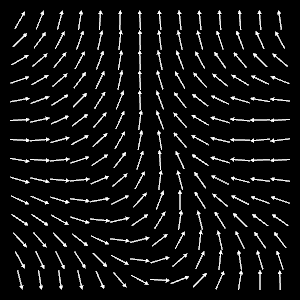

#exploring-noise
This is just me experimenting with [nannou](https://nannou.cc/). You can find my _projects_ in the subfolder [src](./src).

You can run each project by ```cargo run --bin <name of the project>```.

For the _polygon_ you would run ```cargo run --bin polygon```.

polygon   | arrows
:-: | :-:
 | 
